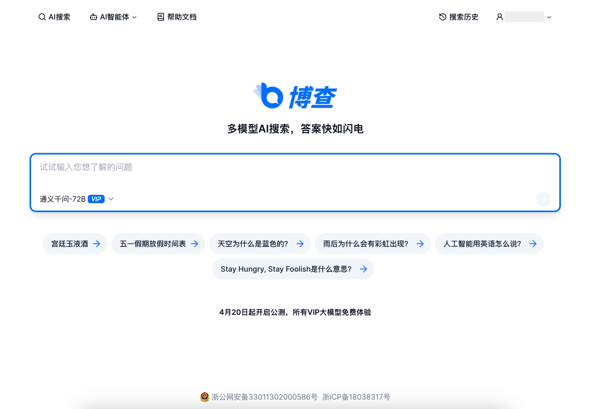
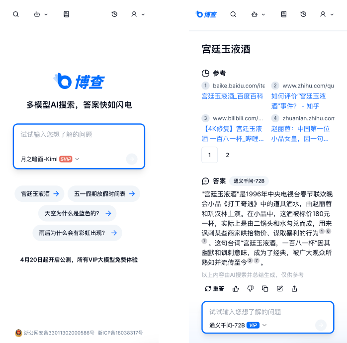
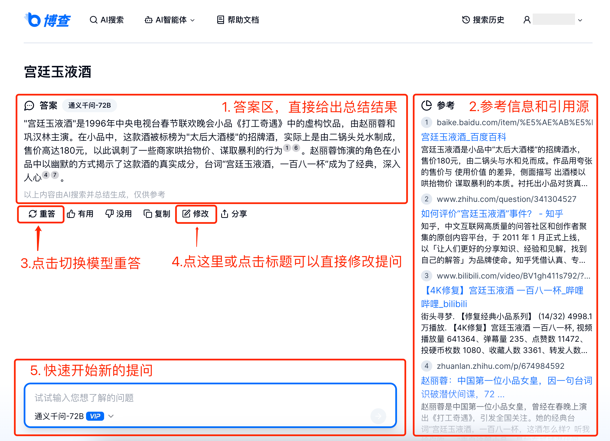
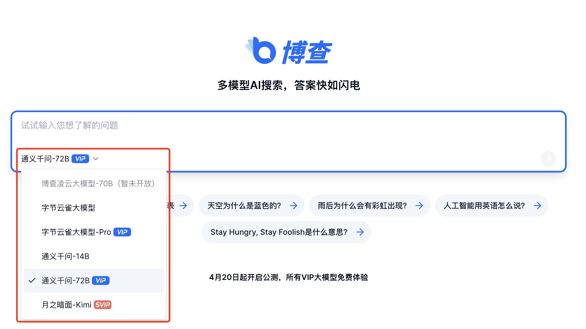
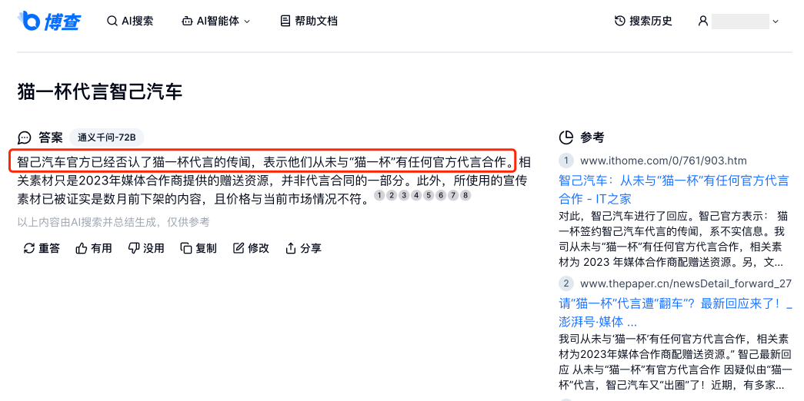
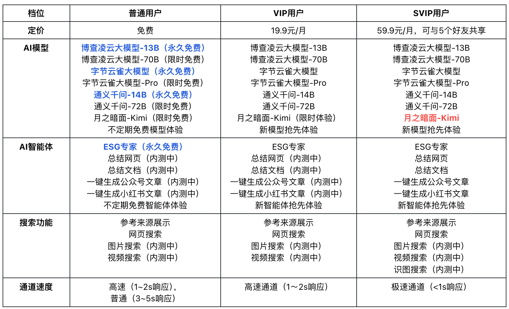

# 博查AI搜索 - 多模型AI搜索，答案快如闪电
博查AI搜索4月20日起开启公测，所有VIP模型免费使用🎉。

您可以通过以下入口体验：
[https://bochaai.com](https://bochaai.com)

# 什么是博查AI搜索？
在过去的二十年里，我们通过搜索引擎浏览互联网。然而，传统搜索引擎的置顶内容充满了广告、营销号文章的干扰，我们无法找到真正有用的信息。

未来的搜索引擎将直接提供答案而非链接，通过可信的参考来源，由大模型推理、总结出容易阅读的结论，直接给出问题的准确答案。

博查AI搜索是一个基于大模型和实时搜索技术的答案引擎。你可以用自然语言提问，它会理解问题、细分检索并直接生成准确的答案。

# 体验优势
- 提供干净、整洁的搜索体验，没有广告和跟踪
- 支持多款AI大模型，可切换模型快速重答
- 拥有完整的搜索引擎，提供实时信息和可靠参考源
- 快速作答，当时间紧迫且需要快速答复时非常有用

# 功能亮点
## 1. 多模型AI搜索
- 博查已经接入了阿里通义千问、字节云雀大模型、月之暗面Kimi等国产顶尖AI大模型，以确保多样化和优质的答案输出。
- 可以根据具体需求选择不同的模型，若答案未达预期可切换重答，总有一个模型能提供满意答案。

## 2. 实时信息和可靠参考源
- 结合实时搜索技术，博查能够引入即时信息，弥补传统大模型知识库的时效性问题。
- 提供事实基础上的准确回答。每个回答都会提供清晰的参考来源，确保信息的可靠性和透明性，消除“幻觉”现象。

## 3. 快速作答
我们调整了大模型搜索的技术架构，特别是Function Call（插件调用）的处理方式，同时对搜索总结场景进行速度优化，不再像传统大模型联网搜索那样有3~7s的等待时间。
## 4. AI智能体深度回答（内测中）
引入AI智能体，提供更加丰富和深入的答案。这一新功能目前处于内测阶段，可以进一步提升使用体验。

# 抢先体验
欢迎大家加入内测群，成为博查抢先版的体验者。内测用户将根据实际使用场景获得SVIP权限和先行功能体验。

# 会员体系
420起开启公测，所有VIP大模型均可免费使用。

>博查自研凌云大模型-13B/70B正在内测中，测试完成后会公测开放。

# 商务合作
云资源、大模型、内容合作请联系：Albert（ljw@hzxmfg.com）。
